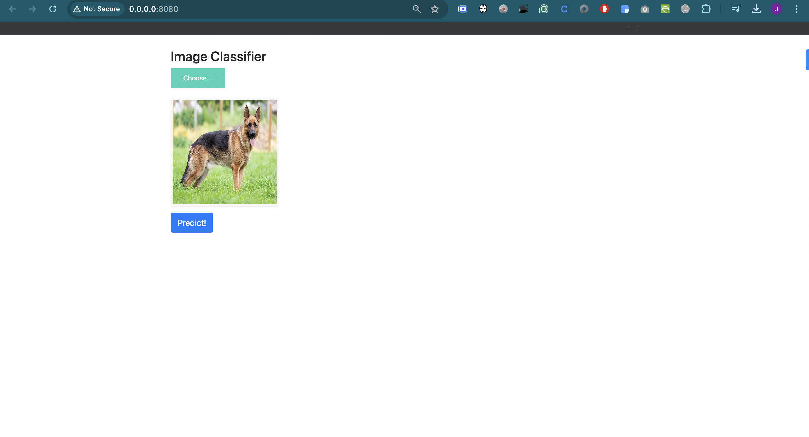
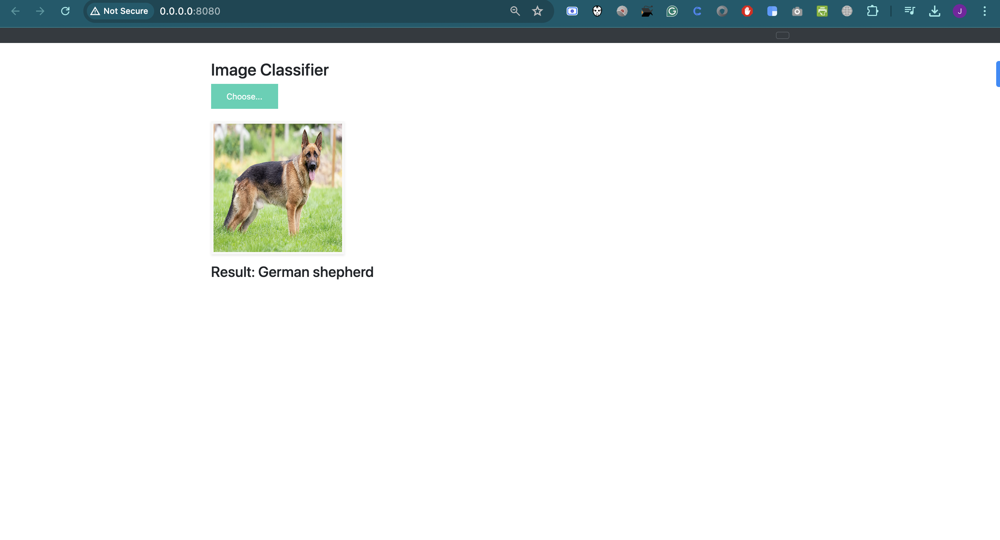
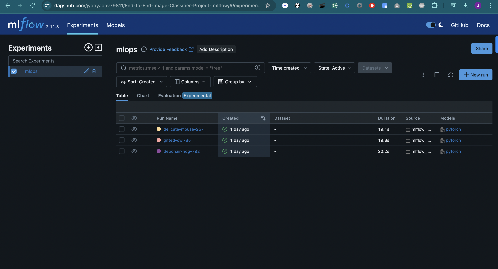
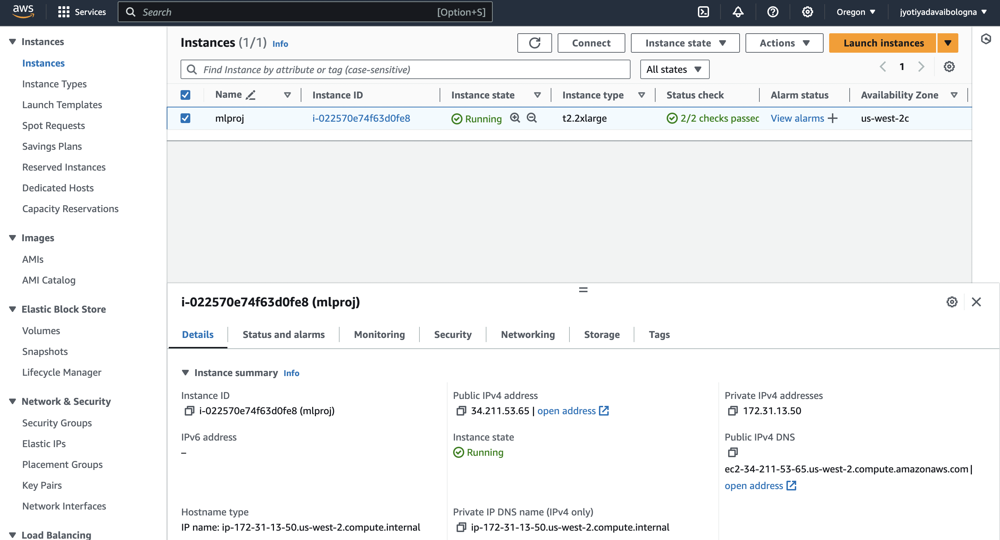
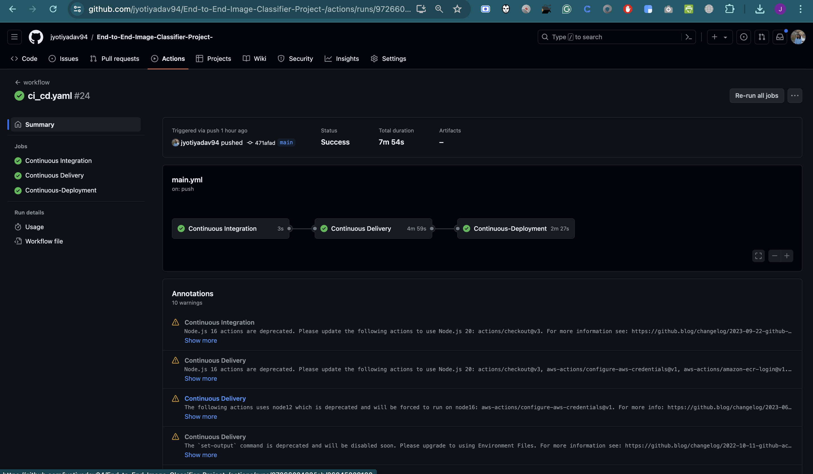
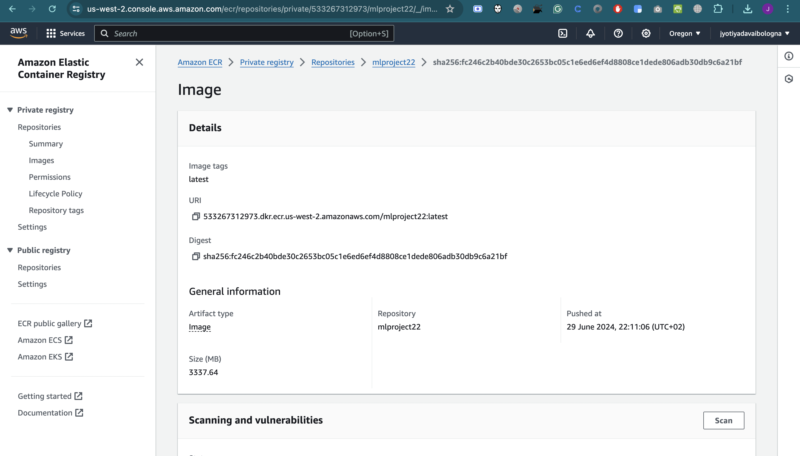
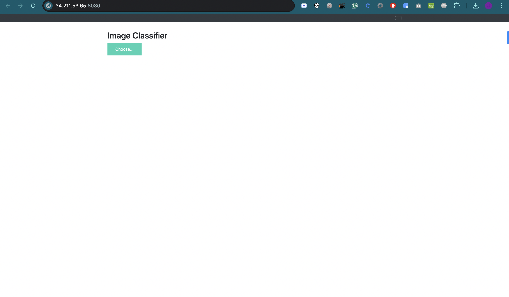
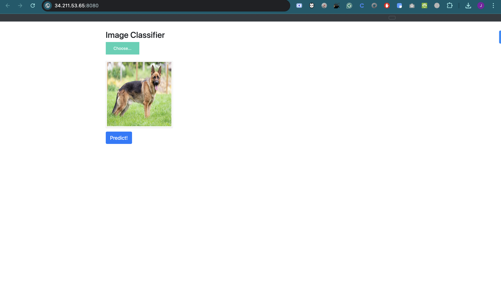
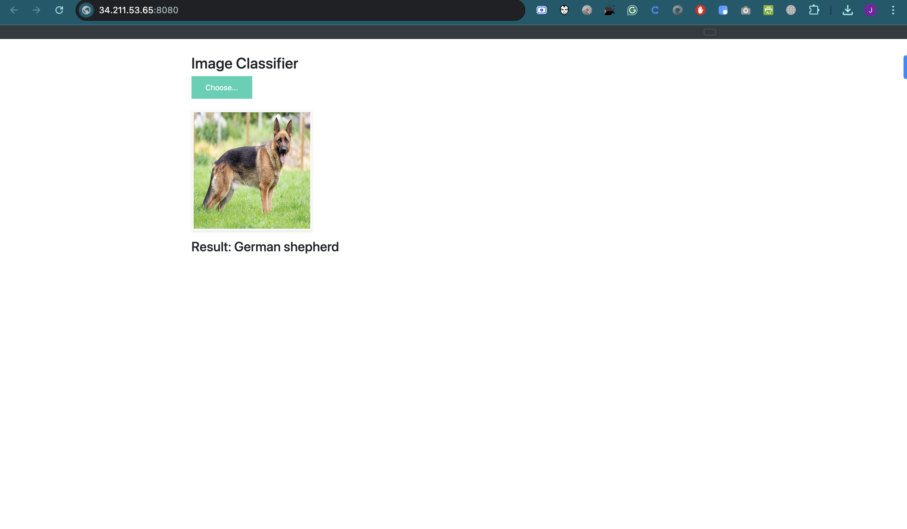

End-to-End-MLOPS-Image-Classifier-Project
# End-to-End-Image-Classifier-Project

This repository contains a comprehensive project for image classification utilizing the pre-trained MobileNetV3 Small model. The primary goals include developing a robust MLOps pipeline and deploying the image classification application on AWS utlizing CI/CD. For simplicity we are building a synchronous archeitecture. 


# Project Organization
------------

```
📦 
├─ .github
│  └─ workflows
│     └─ main.yml
├─ .gitignore
├─ Dockerfile
├─ LICENSE
├─ Makefile
├─ README.md
├─ app.py
├─ docker-compose.yml
├─ docs
│  ├─ Makefile
│  ├─ commands.rst
│  ├─ conf.py
│  ├─ getting-started.rst
│  ├─ index.rst
│  └─ make.bat
├─ mlartifacts
│  ├─ 181041994711703762
│  │  ├─ cc6e377d69c9407c96eb0dce9fa193fb
│  │  │  └─ artifacts
│  │  │     ├─ mobilenetv3_small_100.pth
│  │  │     └─ model
│  │  │        ├─ MLmodel
│  │  │        ├─ conda.yaml
│  │  │        ├─ data
│  │  │        │  ├─ model.pth
│  │  │        │  └─ pickle_module_info.txt
│  │  │        ├─ metadata
│  │  │        │  ├─ MLmodel
│  │  │        │  ├─ conda.yaml
│  │  │        │  ├─ python_env.yaml
│  │  │        │  └─ requirements.txt
│  │  │        ├─ python_env.yaml
│  │  │        └─ requirements.txt
│  │  ├─ ed3aae914d47450abb5ee48826a1f2e9
│  │  │  └─ artifacts
│  │  │     ├─ mobilenetv3_small_100.pth
│  │  │     └─ model
│  │  │        ├─ MLmodel
│  │  │        ├─ conda.yaml
│  │  │        ├─ data
│  │  │        │  ├─ model.pth
│  │  │        │  └─ pickle_module_info.txt
│  │  │        ├─ metadata
│  │  │        │  ├─ MLmodel
│  │  │        │  ├─ conda.yaml
│  │  │        │  ├─ python_env.yaml
│  │  │        │  └─ requirements.txt
│  │  │        ├─ python_env.yaml
│  │  │        └─ requirements.txt
│  │  └─ fc014b754bac481c92a98ae80aa1e8f0
│  │     └─ artifacts
│  │        ├─ mobilenetv3_small_100.pth
│  │        └─ model
│  │           ├─ MLmodel
│  │           ├─ conda.yaml
│  │           ├─ data
│  │           │  ├─ model.pth
│  │           │  └─ pickle_module_info.txt
│  │           ├─ metadata
│  │           │  ├─ MLmodel
│  │           │  ├─ conda.yaml
│  │           │  ├─ python_env.yaml
│  │           │  └─ requirements.txt
│  │           ├─ python_env.yaml
│  │           └─ requirements.txt
│  ├─ 189051010906149924
│  │  ├─ 1bdcaa6e348c4ae998aaa0ee552321b7
│  │  │  └─ artifacts
│  │  │     ├─ mobilenetv3_small_100.pth
│  │  │     └─ model
│  │  │        ├─ MLmodel
│  │  │        ├─ conda.yaml
│  │  │        ├─ data
│  │  │        │  ├─ model.pth
│  │  │        │  └─ pickle_module_info.txt
│  │  │        ├─ metadata
│  │  │        │  ├─ MLmodel
│  │  │        │  ├─ conda.yaml
│  │  │        │  ├─ python_env.yaml
│  │  │        │  └─ requirements.txt
│  │  │        ├─ python_env.yaml
│  │  │        └─ requirements.txt
│  │  ├─ 1cfa4a214264416787c3bb8e75f25c58
│  │  │  └─ artifacts
│  │  │     ├─ mobilenetv3_small_100.pth
│  │  │     └─ model
│  │  │        ├─ MLmodel
│  │  │        ├─ conda.yaml
│  │  │        ├─ data
│  │  │        │  ├─ model.pth
│  │  │        │  └─ pickle_module_info.txt
│  │  │        ├─ metadata
│  │  │        │  ├─ MLmodel
│  │  │        │  ├─ conda.yaml
│  │  │        │  ├─ python_env.yaml
│  │  │        │  └─ requirements.txt
│  │  │        ├─ python_env.yaml
│  │  │        └─ requirements.txt
│  │  ├─ 32c75564041343f9986b39c4c6f776d4
│  │  │  └─ artifacts
│  │  │     ├─ mobilenetv3_small_100.pth
│  │  │     └─ model
│  │  │        ├─ MLmodel
│  │  │        ├─ conda.yaml
│  │  │        ├─ data
│  │  │        │  ├─ model.pth
│  │  │        │  └─ pickle_module_info.txt
│  │  │        ├─ metadata
│  │  │        │  ├─ MLmodel
│  │  │        │  ├─ conda.yaml
│  │  │        │  ├─ python_env.yaml
│  │  │        │  └─ requirements.txt
│  │  │        ├─ python_env.yaml
│  │  │        └─ requirements.txt
│  │  ├─ 6010ec0c620c4065bb13db03898c579f
│  │  │  └─ artifacts
│  │  │     ├─ mobilenetv3_small_100.pth
│  │  │     └─ model
│  │  │        ├─ MLmodel
│  │  │        ├─ conda.yaml
│  │  │        ├─ data
│  │  │        │  ├─ model.pth
│  │  │        │  └─ pickle_module_info.txt
│  │  │        ├─ metadata
│  │  │        │  ├─ MLmodel
│  │  │        │  ├─ conda.yaml
│  │  │        │  ├─ python_env.yaml
│  │  │        │  └─ requirements.txt
│  │  │        ├─ python_env.yaml
│  │  │        └─ requirements.txt
│  │  ├─ 9118cedc2c174403bc442ff4f46cc651
│  │  │  └─ artifacts
│  │  │     ├─ mobilenetv3_small_100.pth
│  │  │     └─ model
│  │  │        ├─ MLmodel
│  │  │        ├─ conda.yaml
│  │  │        ├─ data
│  │  │        │  ├─ model.pth
│  │  │        │  └─ pickle_module_info.txt
│  │  │        ├─ metadata
│  │  │        │  ├─ MLmodel
│  │  │        │  ├─ conda.yaml
│  │  │        │  ├─ python_env.yaml
│  │  │        │  └─ requirements.txt
│  │  │        ├─ python_env.yaml
│  │  │        └─ requirements.txt
│  │  ├─ d1041fc3af914076b6f8965f64cca410
│  │  │  └─ artifacts
│  │  │     ├─ mobilenetv3_small_100.pth
│  │  │     └─ model
│  │  │        ├─ MLmodel
│  │  │        ├─ conda.yaml
│  │  │        ├─ data
│  │  │        │  ├─ model.pth
│  │  │        │  └─ pickle_module_info.txt
│  │  │        ├─ metadata
│  │  │        │  ├─ MLmodel
│  │  │        │  ├─ conda.yaml
│  │  │        │  ├─ python_env.yaml
│  │  │        │  └─ requirements.txt
│  │  │        ├─ python_env.yaml
│  │  │        └─ requirements.txt
│  │  └─ d3891db1016b47beb9315e35278bb76f
│  │     └─ artifacts
│  │        ├─ mobilenetv3_small_100.pth
│  │        └─ model
│  │           ├─ MLmodel
│  │           ├─ conda.yaml
│  │           ├─ data
│  │           │  ├─ model.pth
│  │           │  └─ pickle_module_info.txt
│  │           ├─ metadata
│  │           │  ├─ MLmodel
│  │           │  ├─ conda.yaml
│  │           │  ├─ python_env.yaml
│  │           │  └─ requirements.txt
│  │           ├─ python_env.yaml
│  │           └─ requirements.txt
│  └─ 802728868213078520
│     └─ 78c72a1bc8c44a57920a08aee34e327d
│        └─ artifacts
│           ├─ mobilenetv3_small_100.pth
│           └─ model
│              ├─ MLmodel
│              ├─ conda.yaml
│              ├─ data
│              │  ├─ model.pth
│              │  └─ pickle_module_info.txt
│              ├─ metadata
│              │  ├─ MLmodel
│              │  ├─ conda.yaml
│              │  ├─ python_env.yaml
│              │  └─ requirements.txt
│              ├─ python_env.yaml
│              └─ requirements.txt
├─ mlruns
│  ├─ 0
│  │  ├─ 193e0a9071da49e18a91d2c9be4e5580
│  │  │  ├─ meta.yaml
│  │  │  ├─ params
│  │  │  │  └─ model_name
│  │  │  └─ tags
│  │  │     ├─ mlflow.runName
│  │  │     ├─ mlflow.source.name
│  │  │     ├─ mlflow.source.type
│  │  │     └─ mlflow.user
│  │  ├─ c30b4d1ff5bb40f8b51a14ce4068579e
│  │  │  ├─ meta.yaml
│  │  │  ├─ params
│  │  │  │  └─ model_name
│  │  │  └─ tags
│  │  │     ├─ mlflow.runName
│  │  │     ├─ mlflow.source.name
│  │  │     ├─ mlflow.source.type
│  │  │     └─ mlflow.user
│  │  └─ meta.yaml
│  ├─ 181041994711703762
│  │  ├─ cc6e377d69c9407c96eb0dce9fa193fb
│  │  │  ├─ meta.yaml
│  │  │  ├─ params
│  │  │  │  └─ model_name
│  │  │  └─ tags
│  │  │     ├─ mlflow.log-model.history
│  │  │     ├─ mlflow.runName
│  │  │     ├─ mlflow.source.name
│  │  │     ├─ mlflow.source.type
│  │  │     └─ mlflow.user
│  │  ├─ ed3aae914d47450abb5ee48826a1f2e9
│  │  │  ├─ meta.yaml
│  │  │  ├─ params
│  │  │  │  └─ model_name
│  │  │  └─ tags
│  │  │     ├─ mlflow.log-model.history
│  │  │     ├─ mlflow.runName
│  │  │     ├─ mlflow.source.name
│  │  │     ├─ mlflow.source.type
│  │  │     └─ mlflow.user
│  │  ├─ fc014b754bac481c92a98ae80aa1e8f0
│  │  │  ├─ meta.yaml
│  │  │  ├─ params
│  │  │  │  └─ model_name
│  │  │  └─ tags
│  │  │     ├─ mlflow.log-model.history
│  │  │     ├─ mlflow.runName
│  │  │     ├─ mlflow.source.name
│  │  │     ├─ mlflow.source.type
│  │  │     └─ mlflow.user
│  │  └─ meta.yaml
│  ├─ 189051010906149924
│  │  ├─ 1bdcaa6e348c4ae998aaa0ee552321b7
│  │  │  ├─ meta.yaml
│  │  │  ├─ params
│  │  │  │  └─ model_name
│  │  │  └─ tags
│  │  │     ├─ mlflow.log-model.history
│  │  │     ├─ mlflow.runName
│  │  │     ├─ mlflow.source.name
│  │  │     ├─ mlflow.source.type
│  │  │     └─ mlflow.user
│  │  ├─ 1cfa4a214264416787c3bb8e75f25c58
│  │  │  ├─ meta.yaml
│  │  │  ├─ params
│  │  │  │  └─ model_name
│  │  │  └─ tags
│  │  │     ├─ mlflow.log-model.history
│  │  │     ├─ mlflow.runName
│  │  │     ├─ mlflow.source.name
│  │  │     ├─ mlflow.source.type
│  │  │     └─ mlflow.user
│  │  ├─ 32c75564041343f9986b39c4c6f776d4
│  │  │  ├─ meta.yaml
│  │  │  ├─ params
│  │  │  │  └─ model_name
│  │  │  └─ tags
│  │  │     ├─ mlflow.log-model.history
│  │  │     ├─ mlflow.runName
│  │  │     ├─ mlflow.source.name
│  │  │     ├─ mlflow.source.type
│  │  │     └─ mlflow.user
│  │  ├─ 6010ec0c620c4065bb13db03898c579f
│  │  │  ├─ meta.yaml
│  │  │  ├─ params
│  │  │  │  └─ model_name
│  │  │  └─ tags
│  │  │     ├─ mlflow.log-model.history
│  │  │     ├─ mlflow.runName
│  │  │     ├─ mlflow.source.name
│  │  │     ├─ mlflow.source.type
│  │  │     └─ mlflow.user
│  │  ├─ 9118cedc2c174403bc442ff4f46cc651
│  │  │  ├─ meta.yaml
│  │  │  ├─ params
│  │  │  │  └─ model_name
│  │  │  └─ tags
│  │  │     ├─ mlflow.log-model.history
│  │  │     ├─ mlflow.runName
│  │  │     ├─ mlflow.source.name
│  │  │     ├─ mlflow.source.type
│  │  │     └─ mlflow.user
│  │  ├─ a5999da21d5c4f3fa68390376e0731c8
│  │  │  ├─ meta.yaml
│  │  │  ├─ params
│  │  │  │  └─ model_name
│  │  │  └─ tags
│  │  │     ├─ mlflow.runName
│  │  │     ├─ mlflow.source.name
│  │  │     ├─ mlflow.source.type
│  │  │     └─ mlflow.user
│  │  ├─ d1041fc3af914076b6f8965f64cca410
│  │  │  ├─ meta.yaml
│  │  │  ├─ params
│  │  │  │  └─ model_name
│  │  │  └─ tags
│  │  │     ├─ mlflow.log-model.history
│  │  │     ├─ mlflow.runName
│  │  │     ├─ mlflow.source.name
│  │  │     ├─ mlflow.source.type
│  │  │     └─ mlflow.user
│  │  ├─ d3891db1016b47beb9315e35278bb76f
│  │  │  ├─ meta.yaml
│  │  │  ├─ params
│  │  │  │  └─ model_name
│  │  │  └─ tags
│  │  │     ├─ mlflow.log-model.history
│  │  │     ├─ mlflow.runName
│  │  │     ├─ mlflow.source.name
│  │  │     ├─ mlflow.source.type
│  │  │     └─ mlflow.user
│  │  └─ meta.yaml
│  └─ 802728868213078520
│     ├─ 78c72a1bc8c44a57920a08aee34e327d
│     │  ├─ meta.yaml
│     │  ├─ params
│     │  │  └─ model_name
│     │  └─ tags
│     │     ├─ mlflow.log-model.history
│     │     ├─ mlflow.runName
│     │     ├─ mlflow.source.name
│     │     ├─ mlflow.source.type
│     │     └─ mlflow.user
│     ├─ 9575abe392f54b54bdcaf803b1df3fd4
│     │  ├─ meta.yaml
│     │  ├─ params
│     │  │  └─ model_name
│     │  └─ tags
│     │     ├─ mlflow.runName
│     │     ├─ mlflow.source.name
│     │     ├─ mlflow.source.type
│     │     └─ mlflow.user
│     ├─ 9dd11d5bda854d29b7e0b8f3d28266f7
│     │  ├─ meta.yaml
│     │  ├─ params
│     │  │  └─ model_name
│     │  └─ tags
│     │     ├─ mlflow.runName
│     │     ├─ mlflow.source.name
│     │     ├─ mlflow.source.type
│     │     └─ mlflow.user
│     └─ meta.yaml
├─ models
│  ├─ .gitkeep
│  ├─ config.json
│  └─ mobilenetv3_small_100.pth
├─ notebooks
│  └─ .gitkeep
├─ params.yaml
├─ prediction_service
│  ├─ __init__.py
│  ├─ prediction.py
│  └─ schema_in.json
├─ references
│  └─ .gitkeep
├─ reports
│  ├─ .gitkeep
│  ├─ figures
│  │  └─ .gitkeep
│  └─ imagenet_classes.txt
├─ requirements.txt
├─ saved_models
│  ├─ config.json
│  ├─ imagenet_classes.txt
│  └─ mobilenetv3_small_100.pth
├─ setup.py
├─ src
│  ├─ .gitkeep
│  ├─ __init__.py
│  ├─ analyse_data.py
│  ├─ get_data.py
│  ├─ load_data.py
│  ├─ mlflow_logging.py
│  ├─ train_and_validate.py
│  └─ transform_data.py
├─ test_environment.py
├─ tox.ini
└─ webapp
   ├─ .gitkeep
   ├─ static
   │  ├─ css
   │  │  └─ main.css
   │  └─ js
   │     └─ main.js
   └─ templates
      ├─ base.html
      └─ index.html
```
--------

# Set up environment
Clone the project:

```bash
https://github.com/jyotiyadav94/End-to-End-Image-Classifier-Project-.git
```

Create and activate an environment: 

```bash
conda create -n your_env_name python=3.8 -y
```

```bash
conda activate your_env_name
```

Install the requirements for this project:

```bash
pip install -r requirements.txt
```

# Local API & Dockerization

Ensure Docker is installed on your machine before proceeding.
Use the following command to build the Docker images. 
```bash
docker-compose build
```

Start the Docker containers & This will launch the application.
```bash
docker-compose up
```



# MLFLOW Results 

While for Now we didn't perform any actual training since we use the Pre-trained Model. We can keep track of our experiments in MLflow each time we run our model. 



Track the experiments in Dagshub.
```bash
https://dagshub.com/jyotiyadav79811/End-to-End-Image-Classifier-Project-.mlflow/#/experiments/0?searchFilter=&orderByKey=attributes.start_time&orderByAsc=false&startTime=ALL&lifecycleFilter=Active&modelVersionFilter=All+Runs&datasetsFilter=W10%3D
```

# Cloud API  & CI/CD 

## AWS-CICD-Deployment-with-Github-Actions

1. Login to AWS console.
2. Create IAM user for deployment

## with specific access

1. **EC2 access**: It is a virtual machine.
2. **ECR**: Elastic Container Registry to save your Docker image in AWS.

## Description: About the deployment

1. Build Docker image of the source code.
2. Push your Docker image to ECR.
3. Launch your EC2.
4. Pull your image from ECR in EC2.
5. Launch your Docker image in EC2.

## Policy

1. AmazonEC2ContainerRegistryFullAccess
2. AmazonEC2FullAccess

3. Create ECR repo to store/save Docker image
   - Save the URI: 
4. Create EC2 machine (Ubuntu)
5. Open EC2 and Install Docker in EC2 Machine:

### Optional

```bash
sudo apt-get update -y
sudo apt-get upgrade
curl -fsSL https://get.docker.com -o get-docker.sh
sudo sh get-docker.sh
sudo usermod -aG docker ubuntu
newgrp docker
```

6. Configure EC2 as self-hosted runner:
- Settings > Actions > Runner > New self-hosted runner > Choose OS > Then run commands one by one

7. Setup GitHub secrets:

- AWS_ACCESS_KEY_ID=
- AWS_SECRET_ACCESS_KEY=
- AWS_REGION=
- AWS_ECR_LOGIN_URI=
- ECR_REPOSITORY_NAME=

8. Configure Git:
git config --global user.name " "


CI/CD set up gitup Actions

Ec2 instance 




Push Image through Continous Deployment









# DocStrings 
**Extension:** Python DocString Generator

# Documentation
**Library:** mkdocs

```bash
mkdocs serve
```
```bash
http://127.0.0.1:8000/
```

# Styling 

## Black - Styling your code
**Library:** Black
```bash
black .
```

## isort - Organizing imports
**Library:** isort
```bash
isort .
```

## Flake8 - Enforcing code quality
**Library:** Flake8
```bash
isort .
```

## Pre-commit install
**Library:** pre-commit
```bash
Pre-commit install 
```


